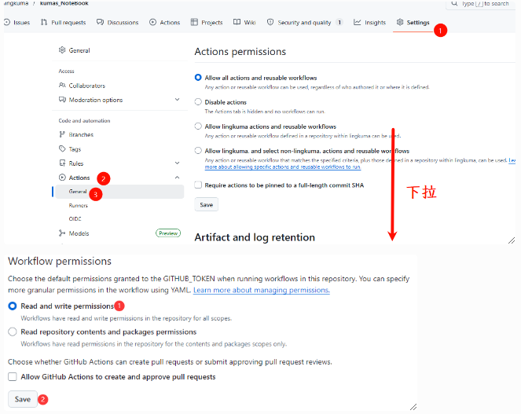
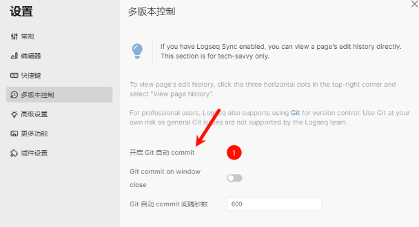
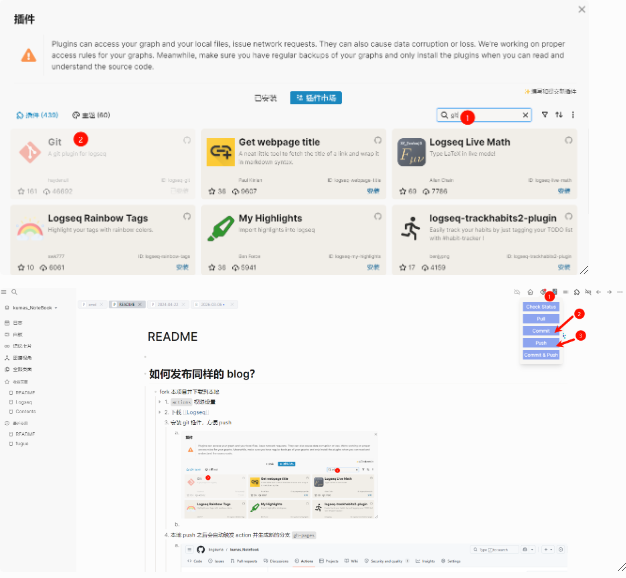
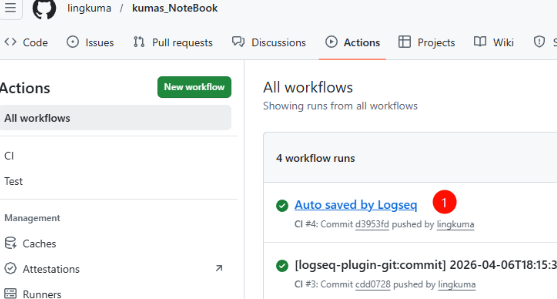
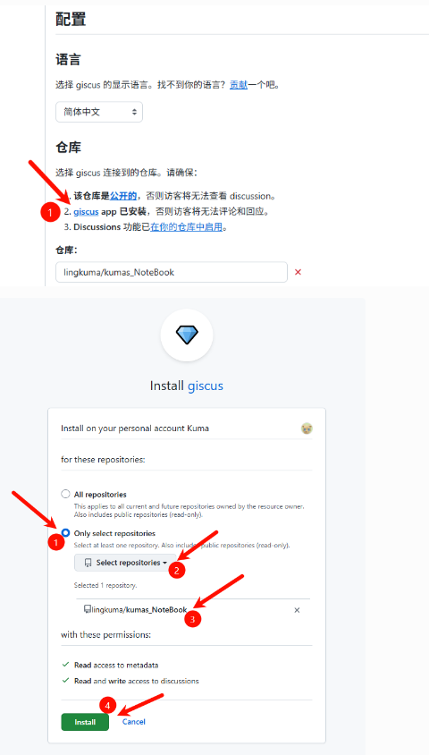
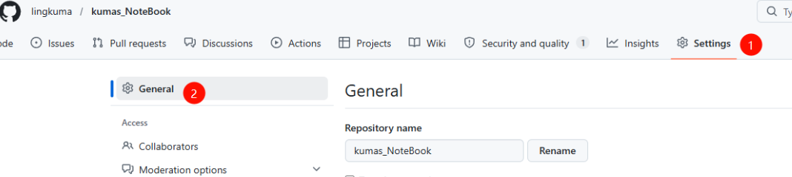
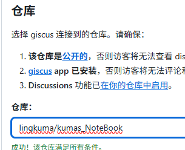
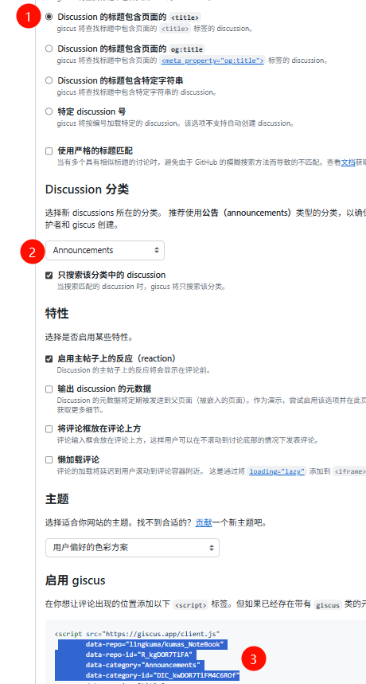
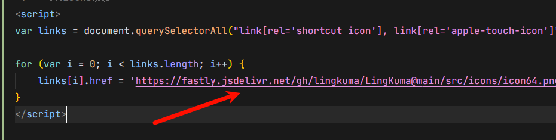

-
- # 如何发布同样的blog？
	- 一键安装部署
	  logseq.order-list-type:: number
		- fork本项目并下载到本地
		  logseq.order-list-type:: number
			- `actions`权限设置
			  logseq.order-list-type:: number
				- 
				-
				-
				-
			- 在 [[fugue]]内导入该仓库，并将分支设置成：`gh-pages`
			  logseq.order-list-type:: number
				- logseq.order-list-type:: number
				- logseq.order-list-type:: number
				- logseq.order-list-type:: number
	- 编辑和后续上传笔记
	  logseq.order-list-type:: number
		- 下载 [[Logseq]]
		  logseq.order-list-type:: number
			- id:: 69d4971d-f5be-460b-8b79-472837b9d75d
			  > 开源大纲双链笔记
			- [Release Desktop/Android APP 0.10.9 (Beta Testing) · logseq/logseq](https://github.com/logseq/logseq/releases/tag/0.10.9)‘
		- [[Logseq]] 设置内启动自动commit
		  logseq.order-list-type:: number
			- 
		- 安装git插件，方便push
		  logseq.order-list-type:: number
			- 
			  logseq.order-list-type:: number
			- logseq.order-list-type:: number
			- logseq.order-list-type:: number
			- logseq.order-list-type:: number
		- 本地push之后会自动触发action并生成新的分支`gh-pages`,即我们的前端渲染页面
		  logseq.order-list-type:: number
			- 
			  logseq.order-list-type:: number
-
-
- # 进阶脚本注入：`评论区`和`icons 图标`
	- 评论区设置
		- 访问  [giscus](https://giscus.app/zh-CN)
		  logseq.order-list-type:: number
			- 点击 安装 giscus
			  logseq.order-list-type:: number
				- 
				  logseq.order-list-type:: number
				- logseq.order-list-type:: number
				- logseq.order-list-type:: number
		- 启动 仓库的 Discussions 社区讨论功能
		  logseq.order-list-type:: number
			- 进入设置
			  logseq.order-list-type:: number
				- 
				  logseq.order-list-type:: number
			- 下拉找到 Discussions 并勾选
			  logseq.order-list-type:: number
				- 
				  logseq.order-list-type:: number
			- logseq.order-list-type:: number
		- 重新检查条件
		  logseq.order-list-type:: number
			- 
			  logseq.order-list-type:: number
		- 选择参数，并复制
		  logseq.order-list-type:: number
			- logseq.order-list-type:: number
			  ```javascript
			  <!-- 评论系统 -->
			  <script src="https://giscus.app/client.js"
			          data-repo="lingkuma/kumas_NoteBook"
			          data-repo-id="R_kgDOR7TiFA"
			          data-category="Announcements"
			          data-category-id="DIC_kwDOR7TiFM4C6ROf"
			          data-mapping="title"
			          data-strict="0"
			          data-reactions-enabled="1"
			          data-emit-metadata="0"
			          data-input-position="bottom"
			          data-theme="preferred_color_scheme"
			          data-lang="zh-CN"
			          data-loading="lazy"
			          crossorigin="anonymous"
			          async>
			  </script>
			  ```
			- 
			  logseq.order-list-type:: number
			- logseq.order-list-type:: number
		- 粘贴到 `\kumas_NoteBook\logseq\inject.html` 内即可
		  logseq.order-list-type:: number
	- icons设置
		- 修改 \kumas_NoteBook\logseq\inject.html 内底部`script`内的icons url即可
		  logseq.order-list-type:: number
			- 
			  logseq.order-list-type:: number
		-
-