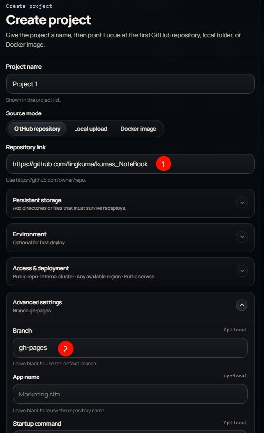

-
-
- ## 技巧
	- [[启动命令]] 中可以使用 `&&` 来连接多条命令
		- `python app1.py && python app2.py`
-
- ## 部署
	- 如何部署一个 [[Python]] 项目
	  collapsed:: true
		- https://res.cloudinary.com/dux7dnl5b/image/upload/v1775535419/bwt5e47omuiubyrae1q9.png
	- 如何部署一个[[html]]静态网页
	  id:: 69d4855a-519c-4dc2-bf64-83e6663fe939
	  collapsed:: true
		- 填写项目地址
		  logseq.order-list-type:: number
		- 选择合适的分支，默认不用改
		  logseq.order-list-type:: number
		- 
-
-
-